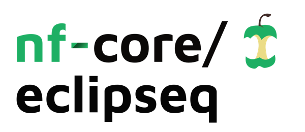
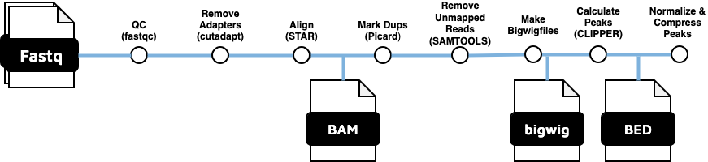

<h1>
  <picture>
    <source media="(prefers-color-scheme: dark)" srcset="docs/images/nf-core-eclipseq_logo_dark.png">
    
  </picture>
</h1>

[](https://github.com/nf-core/eclipseq/actions/workflows/ci.yml)
[](https://github.com/nf-core/eclipseq/actions/workflows/linting.yml)[](https://nf-co.re/eclipseq/results)[](https://doi.org/10.5281/zenodo.XXXXXXX)
[](https://www.nf-test.com)

[](https://www.nextflow.io/)
[](https://docs.conda.io/en/latest/)
[](https://www.docker.com/)
[](https://sylabs.io/docs/)
[](https://cloud.seqera.io/launch?pipeline=https://github.com/nf-core/eclipseq)

[](https://nfcore.slack.com/channels/eclipseq)[](https://twitter.com/nf_core)[](https://mstdn.science/@nf_core)[](https://www.youtube.com/c/nf-core)

## Introduction

**nf-core/eclipseq** is a bioinformatics pipeline that runs a version of [Clipper pipeline](https://www.encodeproject.org/documents/1f171ac6-a36a-41ac-b632-741aeb47aad2/@@download/attachment/eCLIP_analysisSOP_v2.3.pdf). The purpose of this pipeline is to detect RNA Binding protein binding sites.



Workflow steps:

1.  QC with [FastQC](https://www.bioinformatics.babraham.ac.uk/projects/fastqc/)
2.  Trim adapters using [cutadapt](https://cutadapt.readthedocs.io/en/stable/)
3.  Alignment to genome (GRCh38 gencode v36) using [STAR aligner](https://github.com/alexdobin/STAR)
4.  Remove duplicates using [Picard tools](https://broadinstitute.github.io/picard/)
5.  Sorting and indexing and removing unmapped reads using [samtools](http://www.htslib.org/)
6.  Make bigwig files using the [makebigwigfiles](https://github.com/YeoLab/makebigwigfiles) program
7.  Call Peaks using [Clipper](https://github.com/YeoLab/clipper). Concatenate if necessary
8.  Normalize peaks using [Yeolab custom scripts](https://github.com/YeoLab/gscripts/tree/master/perl_scripts)
9.  Perform entropy calculations using [merge peaks scripts](https://github.com/YeoLab/merge_peaks/blob/master/README.md)
10. Calculate the [Irreproducible Discovery Rate](https://arxiv.org/abs/1110.4705)

## Dependencies

- [Nextflow](https://www.nextflow.io/)
- [Singularity](https://sylabs.io/singularity/) or [Docker](https://www.docker.com/) - set the profile as singularity or docker during runtime. If you are using UVM's VACC' then singularity is already installed there.

We suggest you setup a conda/mamba environment and install nextflow.

## Usage

Make a copy of runEclipseq_template.sh to runEclipseq.sh and edit it appropriately.

The genome should hopefully be setup already for your group in a shared space, but if not these are the steps:
Setup the genome:

1. Download the genome you will use
2. Modify indexGenome.sh
3. Run indexGenome.sh
4. Index the genome with "samtools faidx genomeName.fa"
5. Calculate the chromosome sizes using "cut -f1,2 genomeName.fa.fai > sizes.genome"
6. Edit nextflow.config parameter to use this genome.

Then, prepare a samplesheet with your input data that looks as follows:

`samplesheet.csv`:

```csv
ID,SAMPLE,REPLICATE,TYPE,FASTQ1,FASTQ2
CONTROL_REP1_SIGNAL,CONTROL,REP1,SIGNAL,s1_R1.fastq.gz,s1_R2.fastq.gz
```

Each row represents a fastq file (single-end) or a pair of fastq files (paired end).

Now, you can run the pipeline using:

```bash
sbatch runEclipseq.sh samplesheet.csv outputDirectory
```

## Credits

nf-core/eclipseq was originally written by Ramiro Barrantes Reynolds with the help of Zach Miller. We had tremendous help from [Brian Yee](https://yeolab.com/brian-yee), the original developer of Clipper.

This work was possible thanks to support from the [Vermont Integrative Genomics Resource Bioinformatics Core](https://www.med.uvm.edu/vigr/bioinformatics) and [The Translational Global Infectious Diseases Research Center](http://www.med.uvm.edu/tgircobre/home) . Computations using this work are being done using the [Vermont Advanced Computing Core](https://www.uvm.edu/vacc)

## Citations

An extensive list of references for the tools used by the pipeline can be found in the [`CITATIONS.md`](CITATIONS.md) file.

## References

Blue, S. M., B. A. Yee, G. A. Pratt, J. R. Mueller, S. S. Park, A. A. Shishkin, A. C. Starner, E. L. Van Nostrand, and G. W. Yeo. 2022. “Transcriptome-Wide Identification of RNA-Binding Protein Binding Sites Using seCLIP-Seq.” Journal Article. Nat Protoc 17 (5): 1223–65. https://doi.org/10.1038/s41596-022-00680-z.

Li, Q., Brown, J. B., Huang, H., and Bickel, P. J., “Measuring reproducibility of high-throughput experiments”, <i>arXiv e-prints</i>, 2011. doi:10.48550/arXiv.1110.4705.

Van Nostrand, Eric L., et al. "Robust, Cost-Effective Profiling of RNA Binding Protein Targets with Single-end Enhanced Crosslinking and Immunoprecipitation (seCLIP)." mRNA Processing. Methods Mol Biol. 2017;1648:177-200.

Van Nostrand, E.L., Pratt, G.A., Shishkin, A.A., Gelboin-Burkhart, C., Fang, M.Y., Sundararaman, B., Blue, S.M., Nguyen, T.B., Surka, C., Elkins, K. and Stanton, R. "Robust transcriptome-wide discovery of RNA-binding protein binding sites with enhanced CLIP (eCLIP)." Nature methods 13.6 (2016): 508-514.
