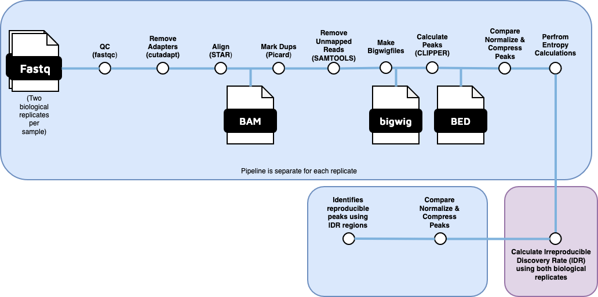

<h1>
  <picture>
    <source media="(prefers-color-scheme: dark)" srcset="docs/images/nf-core-eclipseq_logo_dark.png">
    
  </picture>
</h1>

[](https://github.com/nf-core/eclipseq/actions/workflows/ci.yml)
[](https://github.com/nf-core/eclipseq/actions/workflows/linting.yml)[](https://nf-co.re/eclipseq/results)[](https://doi.org/10.5281/zenodo.XXXXXXX)
[](https://www.nf-test.com)

[](https://www.nextflow.io/)
[](https://docs.conda.io/en/latest/)
[](https://www.docker.com/)
[](https://sylabs.io/docs/)
[](https://cloud.seqera.io/launch?pipeline=https://github.com/nf-core/eclipseq)

[](https://nfcore.slack.com/channels/eclipseq)[](https://twitter.com/nf_core)[](https://mstdn.science/@nf_core)[](https://www.youtube.com/c/nf-core)

## Introduction

**nf-core/eclipseq** is a bioinformatics pipeline that runs a version of [Clipper pipeline](https://www.encodeproject.org/documents/1f171ac6-a36a-41ac-b632-741aeb47aad2/@@download/attachment/eCLIP_analysisSOP_v2.3.pdf). The purpose of this pipeline is to detect RNA Binding protein binding sites.



Workflow steps:
1.  Extract unique molecular barcodes using umi_tools (?do we need this?)
2.  Trim adapters using cutadapt (?? do we have the adaptors)
3.  QC with FastQC
4.  Alignment to genome (GRCh38 gencode v36) using STAR aligner
5.  Sorting and indexing using samtools
6.  Remove duplicates using umi_tools
7.  Call Peaks using Clipper0. Concatenate if necessary
1. Read QC ([`FastQC`](https://www.bioinformatics.babraham.ac.uk/projects/fastqc/))
2. Present QC for raw reads ([`MultiQC`](http://multiqc.info/))

## Usage

If you are new to nextflow and nf-core, please create a mamba/conda environment as follows:

Next, make a copy of runEclipseq_template.sh to runEclipseq.sh and edit it appropriately.

Setup the genome: 

1. Download the genome you will use
2. Modify indexGenome.sh
3. Run indexGenome.sh
4. Index the genome with "samtools faidx genomeName.fa"
5. Calculate the chromosome sizes using "cut -f1,2 genomeName.fa.fai > sizes.genome"
6. Edit nextflow.config parameter to use this genome.

Then, prepare a samplesheet with your input data that looks as follows:

`samplesheet.csv`:

```csv
ID,SAMPLE,REPLICATE,TYPE,FASTQ1,FASTQ2
CONTROL_REP1_SIGNAL,CONTROL,REP1,SIGNAL,s1_R1.fastq.gz,s1_R2.fastq.gz
```

Each row represents a fastq file (single-end) or a pair of fastq files (paired end).

Now, you can run the pipeline using:

```bash
sbatch runEclipseq.sh samplesheet.csv outputDirectory
```
## Credits

nf-core/eclipseq was originally written by Ramiro Barrantes Reynolds with the help of Zach Miller.

## Contributions and Support

If you would like to contribute to this pipeline, please see the [contributing guidelines](.github/CONTRIBUTING.md).

For further information or help, don't hesitate to get in touch on the [Slack `#eclipseq` channel](https://nfcore.slack.com/channels/eclipseq) (you can join with [this invite](https://nf-co.re/join/slack)).

## Citations

<!-- TODO nf-core: Add citation for pipeline after first release. Uncomment lines below and update Zenodo doi and badge at the top of this file. -->
<!-- If you use nf-core/eclipseq for your analysis, please cite it using the following doi: [10.5281/zenodo.XXXXXX](https://doi.org/10.5281/zenodo.XXXXXX) -->


An extensive list of references for the tools used by the pipeline can be found in the [`CITATIONS.md`](CITATIONS.md) file.

You can cite the `nf-core` publication as follows:

> **The nf-core framework for community-curated bioinformatics pipelines.**
>
> Philip Ewels, Alexander Peltzer, Sven Fillinger, Harshil Patel, Johannes Alneberg, Andreas Wilm, Maxime Ulysse Garcia, Paolo Di Tommaso & Sven Nahnsen.
>
> _Nat Biotechnol._ 2020 Feb 13. doi: [10.1038/s41587-020-0439-x](https://dx.doi.org/10.1038/s41587-020-0439-x).
